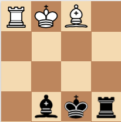
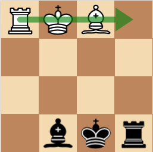
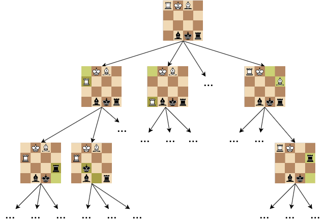

# Implementation of an Alpha-Beta Pruning algorithm to play a simplified version of chess

The objective of this activity comprises the study and modeling of an *alpha-beta pruning* algorithm for its application in a modified version of a chess game.

## Introduction

There are several ways of representing games, the simplest of which may be the normal way. However, representations of games in normal form do not incorporate any notion of sequence, or time, of players' actions. The extended form (or tree) is an alternative representation that makes the temporal structure explicit.

One way of classifying games in the extensive form is between games of perfect information and games of imperfect information. Informally, a perfect information game in extensive form (or, more simply, a perfect information game) is a tree in the sense of graph theory, in which each node represents the choice of one of the players, each edge represents a possible action , and the sheets represent final results on which each player has a utility function. In fact, in certain circles (in particular, in artificial intelligence), they are known simply as hunting trees. Formally, we define them as follows: [[1]](#mas)

* **Perfect information games:** *A (finite) game of perfect information (in long form) is a tuple*
, *where:*
	+ *N* is a set of n players;
	+ *A* is a set of actions;
	+ *H* is a set of non-terminal choice nodes;
	+ *Z* is a set of terminal choice nodes, dislocated from *H*;
	+  is the action function, which assigns each choice node a set of actions possible;
	+  is the function of the player, who assigns to each non-terminal node of a given player  that chooses an action on that node;
	+  is the successor function, which maps a choice node and a action for a new choice node or terminal node, so that for all  and  if  then  and ;
	+  and , where  is a utility function for player i on the Z terminal nodes

The proposal of this work deals with the modeling of a perfect information game in its extensive form and, then, with the application of a *alpha-beta pruning* algorithm modified to find the best action of a player given the state in which the same is found.

## The Game

The modeled game is a simplified version of a game of chess. In a traditional game of chess, two players (white and black pieces) start a game with a total of sixteen pieces each of six different types, on a board with 8x8 squares of alternating colors. The game modeled in this work consists of a 4x4 board, where each player has only three pieces: a king, a rook and a bishop. The figure bellow shows the starting position of the proposed game.

In addition to the board size and number of pieces, some rules present in a traditional chess game were disregarded to ensure the simplicity of the model:

* Firstly, in a classic chess game, a player cannot make a move that puts the king himself in check, or that leaves his king in check. This rule has been disregarded and such moves are absolutely valid in the modified version;

* As a consequence of the previous modification, another modification was necessary: ​​under the rules of classical chess, a game ends when a player is in a check position and there are no possible valid moves for it. As positions that leave the king in check are valid in the modified version, in this case the game ends when a player captures the opposing king;

* To prevent the game from going on forever, a tie condition has been established: if the game is in a state where both players have only the king's pieces, the game will end after three moves and, if no player captures the opponent king at this time, the game ends in a draw;

* Finally, each piece has the same moves available in a classic chess game: rook moves horizontally, bishop diagonally and king can move a single square in any direction and no piece can end in a square where a piece of the same color is positioned. However, for the sake of simplicity, a small change to traditional rules was made. While in the game of chess only the horse can "jump" spaces between its home and destination squares that are occupied, this ability has been replicated for all pieces in this new version of the game (as the king can move only one square in a given direction, this rule is irrelevant to it). The figure bellow shows an example of this rule:

While in a traditional game the movement shown in the figure was not valid due to the existence of pieces between the start and end position of the tower, in the modified version this movement is allowed.

## Modeling in extensive form

As mentioned earlier, the proposed game will be modeled as a zero-sum game of perfect information in extensive form. Game rules in the extensive form are defined by legal positions (or legal states) and legal moves for all legal positions. For each legal position, it is possible to effectively determine all legal movements. Some legal positions are starting positions and others are ending.

The best way to describe these terms is to use a tree chart whose nodes are legal positions and whose borders are legal movements. The graph is directed, as it does not necessarily mean that we will be able to go back exactly where we came from in the previous move. For example, in classical chess, a pawn can only advance. This graph is called a game tree. Moving down the game tree represents one of the players making a move, and the state of the game changes from one legal position to another.

In the figure above, each vertex of the graph represents a possible state of the game, while each edge represents the possible actions to be taken in a given state. The odd levels correspond to the states where the player with the white pieces must take action, while at the even levels, the player with the black pieces must act.

The complete game tree is a game tree whose root is in the starting position and all leaves are in the ending positions. Each complete game tree has as many nodes as the game has possible results for each legal move made. It is easy to notice that, for the game in question, the complete tree is huge and the number of possible states grows exponentially at each level. For this reason, it is not a good practice to explicitly create an entire game tree as a structure when writing a program that should predict the best move at any time. However, nodes must be created implicitly in the visiting process.

## The Algorithm

The purpose of this section is to implement an algorithm that finds the best strategy for the game modeled in the previous section.

The *Backpropagation* algorithm has a systematic search, or more precisely, it uses brute force and a simple evaluation function. In a two-player zero-sum game, one player seeks to minimize the final payoff of the game, while the other seeks to maximize the same. To decide the action to be taken in a given state, the algorithm in its original form performs a search in a complete tree down to the leaves. Effectively, we would analyze all possible results and always be able to determine the best possible move.

However, for non-trivial games, this practice is inapplicable. Even the search to a certain depth sometimes takes an unacceptable amount of time. The *Alpha-Beta Pruning* algorithm optimizes this process by eliminating the search in unnecessary paths and considerably reducing the execution time of the algorithm. Even so, for games like chess, searching the entire tree is not feasible.

To solve this problem, the algorithm used applies the search to a reasonably low tree depth, aided by appropriate heuristics and to a well-designed, but simple, evaluation function. With this approach, we lose the certainty of finding the best possible move, but in most cases the decision made by the algorithm is much better than any human being.

The applied heuristic is as follows:

* Each piece of the game is assigned a value, with positive values for white pieces, and equivalent negative values for black pieces;
* In each state of the game, the \ textit {payoff} is calculated according to the sum of the values of the pieces still present on the board;
* The values defined for each part are:

	+ **Bishop**: 
	+ **Tower**: 
	+ **King**: 

The implemented algorithm therefore applies the heuristic described to the *Alpha-Beta Pruning* algorithm. With this, it is able to view only a limited number of future moves, but it is able to estimate the best possible move given the *payoffs* of the most distant states viewed.

## References
<a id="mas">[1]</a> 
Yoav Shoham, Kevin Leyton Brown. 
Multi Agent Systems, 
Algorithmic, Game-Theoretic, and Logical Foundations. 2010.